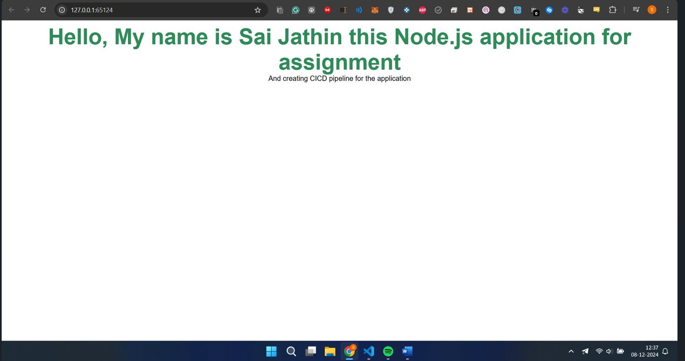
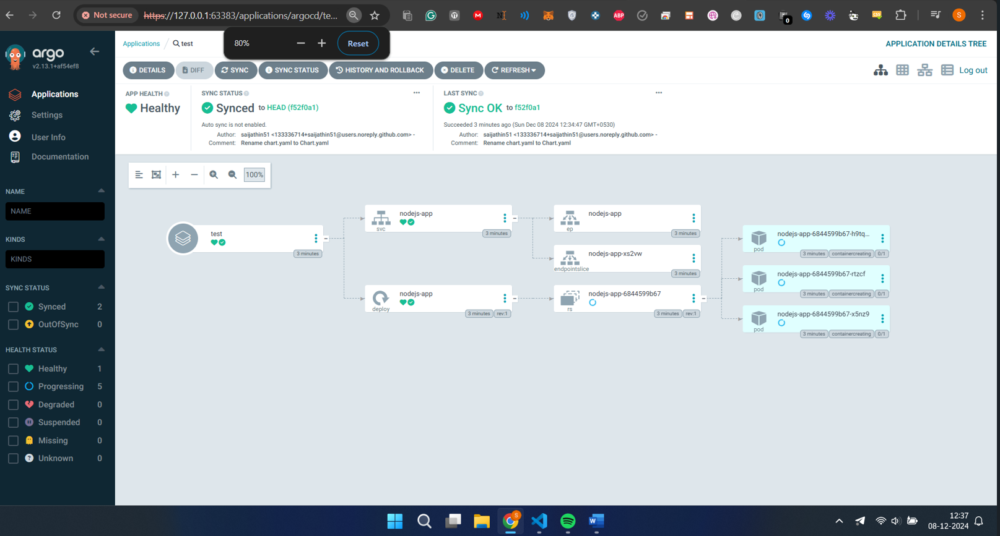

Overview
This repository demonstrates a CI/CD pipeline using GitHub Actions, Helm, and ArgoCD to implement GitOps practices. It automates Docker image building, Kubernetes deployments, and cluster updates, ensuring reliable delivery of application updates.

Prerequisites
Docker Hub Account: For storing Docker images.
Kubernetes Cluster: Running locally or on the cloud.
ArgoCD Setup:
Installed in the Kubernetes cluster.
Configured to monitor this repository.
GitHub Secrets:
DOCKER_USERNAME and DOCKER_PASSWORD for Docker Hub.
Minikube and Argo CD

Approach

Version Control with GitHub:

Source code, Kubernetes manifests (Helm charts), and GitHub Actions workflows are stored in this repository.
Every commit or PR to the main branch triggers the CI/CD pipeline.
Continuous Integration (CI):

Docker Build & Push:
Build the application into a Docker image.
Push the image to Docker Hub with the latest tag.
Validation:
Lint Helm charts and Kubernetes manifests to ensure validity.
Continuous Delivery (CD):

Helm Deployment:
Helm charts deploy the application to the Kubernetes cluster.
Image and tag details are dynamically passed via GitHub Actions.
GitOps with ArgoCD:
ArgoCD monitors this repository for changes and applies them to the cluster.
Kubernetes cluster updates occur automatically when the repo is updated.
Notifications:

Notifications are integrated (optional) to inform about pipeline success or failure.

Argocd image for the reference 

Adding ArgoCD Screenshots
To document your ArgoCD setup visually:
   
   
